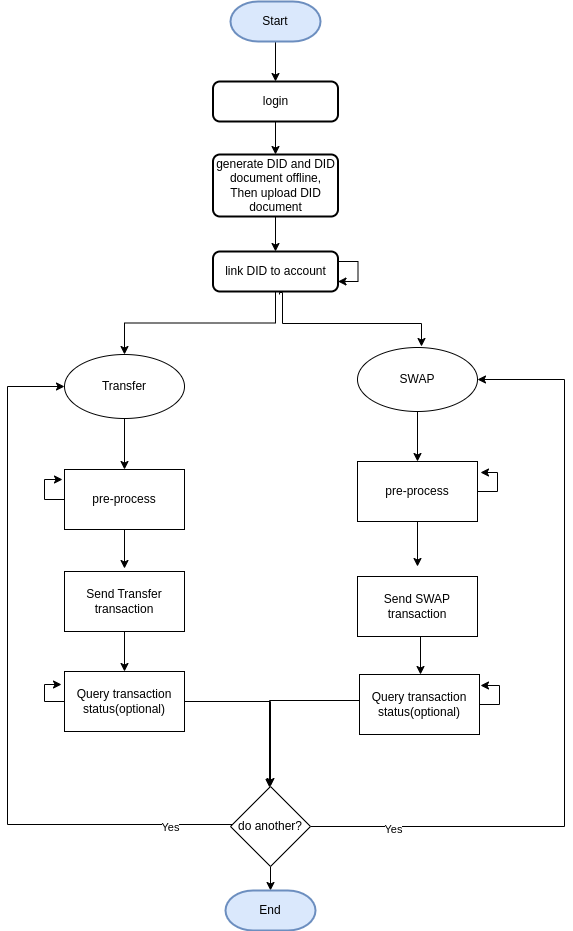

API User Tutorial for Business Node
-----------------------------------

Before using this manual, you need access to one existing Business Node
(BN), or you have set up your local BN via [Setup a Business Node(BN) with
docker-compose](https://github.com/UDPN/BN-Sandbox-selfservice-public)
(Please ensure to complete the onboarding process).

Please read UDPN white paper first to understand the high-level
architecture of the UDPN better. The latest version of the UDPN white
paper can be downloaded:

1.  From UDPN official site soon (http://udpn.io)

2.  Shared by your dedicated UDPN contact person.

3.  Or from your sandbox instance if you have one: [https://\*.sandbox.udpn.io](https://*.sandbox.udpn.io)
    -&gt; Home -&gt; “Download Whitepaper”

Please note that the details regarding the API parameters can be found
via Swagger API:

1.  From your local BN:

[http://localhost:8082/swg/swagger-ui/index.html?urls.primaryName=bnprocesscore](http://localhost:8082/swg/swagger-ui/index.html?urls.primaryName=bnprocesscore)

1.  From your UDPN sandbox, if you have access to one. Confirm with your
    dedicated UDPN contact:

[https://bngateway-yourDomainURL/swg/swagger-ui/index.html](https://your-public-sandbox-URL/swg/swagger-ui/index.html)

1.  From a UDPN public BN instance (read-only, cannot trigger API call)

[https://bngateway-rd.sandbox.udpn.io/swg/swagger-ui/index.html](https://bngateway-rd.sandbox.udpn.io/swg/swagger-ui/index.html)

Summary of API use for sending transfer or SWAP transactions on behalf
of your end user:

Please find below the core APIs used by the IT system operators to
connect to business nodes. Additional details on the API can be found in
the Swagger description provided above. All URLs come from setting up
the BN locally via [Setup a Business Node(BN)
with
docker-compose](https://github.com/UDPN/BN-Sandbox-selfservice-public).

In addition to this tutorial, we will provide a PostMan project
demonstrating how to use the API calls introduced below to complete a
SWAP transaction.

Note: Again, All URLs in following chapters come from setting up the BN
locally via [Setup a Business Node(BN) with
docker-compose](https://github.com/UDPN/BN-Sandbox-selfservice-public).

### Login

The IT system uses this API to log in to their business node. The
default username/password could be found at [this
page](https://github.com/UDPN/BN-Sandbox-selfservice-public/blob/main/sandbox.manual.md)
if you are using [Setup a Business Node(BN) with
docker-compose](https://github.com/UDPN/BN-Sandbox-selfservice-public).
More APIs could be found via swagger.

[http://localhost/v1/udpn/processing/login/manage/login](http://localhost/v1/udpn/processing/login/manage/login)

### DID Document Uploading

A DID is a unique identifier used to represent all UDPN users. You may
generate DID document with below ways:

1.  From your sandbox instance if you have one: [https://\*.sandbox.udpn.io](https://*.sandbox.udpn.io)
    -&gt; “Account Management” -&gt; “DID generation”

2.  If you are using [Setup a Business Node(BN)
    with
    docker-compose](https://github.com/UDPN/BN-Sandbox-selfservice-public),
    you need to navigate to the root directory
    “BN-Sandbox-selfservice-public” and generate an offline DID document
    on behalf of the end-user using the following command

“java -jar
docker-compose/nginx/dist/web/assets/did/udpn-did-sdk-1.0.0.jar”.

After the DID document is generated, you must use the command below to
upload it to a validator node via your business node.

[http://localhost/vn/v1/udpn/did/manage/didContract/storeDidDocumentOnChain](http://localhost/vn/v1/udpn/did/manage/didContract/storeDidDocumentOnChain)

### Link DID to Account

The DID needs to be linked to a digital currency account before we can
transfer/swap funds from that account on the UDPN.

[http://localhost/v1/udpn/processing/account/bind/manage/save](http://localhost/v1/udpn/processing/account/bind/manage/save)

1）Query all currencies and platforms currently supported on the UDPN.

[http://localhost/v1/udpn/processing/common/manage/active/currency/platform/select](http://localhost/v1/udpn/processing/common/manage/active/currency/platform/select)

1.  Query account list with accountBindingId .etc fields linked to
    specific DID

[http://localhost/v1​/udpn​/processing​/account​/bind​/manage​/searchs](http://localhost/v1​/udpn​/processing​/account​/bind​/manage​/searchs)

1.  More details on the APIs can be found in swagger

### Transfer

“Transfer” means moving funds between two accounts in the same digital
currency system.

##### Pre-processing

For a given transfer, query all possible TNs which could process the
transfer.

[http://localhost/v1/udpn/processing/transfer/manage/searchs](http://localhost/v1/udpn/processing/transfer/manage/searchs)

Related query: query all platforms and currencies currently supported on
the UDPN.

[http://localhost/v1/udpn/processing/common/manage/active/currency/platform/select](http://localhost/v1/udpn/processing/common/manage/active/currency/platform/select)

##### Permit

Once a transaction node is chosen to process the transfer, use this API
to collect the relevalt public chain package details.

As a temporary fix, we pass the end-user private key to the transaction
node so that it signs the transaction on behalf of the end user.

We will provide an SDK or manual in production so the IT system can sign
the transaction locally. For obvious security reasons, the private key
cannot be shared and must be safeguarded locally.

[http://localhost/v1/udpn/processing/digital/currency/swap/manage/permit/select](http://localhost/v1/udpn/processing/digital/currency/swap/manage/permit/select)

##### Send a Transfer transaction request

Send a transfer transaction request

More information on how to query the transfer status is provided in the
subsequent sections (Sections 6/7).

[http://localhost/v1/udpn/processing/transfer/manage/save](http://localhost/v1/udpn/processing/transfer/manage/save)

### SWAP

“SWAP” means moving funds between two accounts in two distinct currency
systems.

Pre-processing

For a given SWAP, query all possible TNs which could process the swap.

[http://localhost/v1/udpn/processing/digital/currency/swap/manage/searchs](http://localhost/v1/udpn/processing/transfer/manage/searchs)

Related query: query all platforms and currencies currently supported on
the UDPN.

[http://localhost/v1/udpn/processing/common/manage/active/currency/platform/select](http://localhost/v1/udpn/processing/common/manage/active/currency/platform/select)

##### Permit

Once a transaction node is chosen to process the SWAP, use this API to
collect the relevant public chain package details.

As a temporary fix, we pass the end-user private key to the transaction
node so that it signs the transaction on behalf of the end user.

We will provide an SDK or manual in production so the IT system can sign
the transaction locally. For obvious security reasons, the private key
cannot be shared and must be safeguarded locally.

[http://localhost/v1/udpn/processing/digital/currency/swap/manage/permit/select](http://localhost/v1/udpn/processing/digital/currency/swap/manage/permit/select)

##### Send Swap transaction

Send SWAP transaction.

More information on how to query the swap status is provided in the
subsequent sections .

[http://localhost/v1/udpn/processing/digital/currency/swap/manage/save](http://localhost/v1/udpn/processing/transfer/manage/save)

1.  ### Retrieve the Transfer/SWAP list

    1.  ##### Query transaction list

Used to query all the transactions initiated by the business node

[http://localhost/v1/udpn/processing/digital/currency/swap/manage/swap/transfer/select](http://localhost/v1/udpn/processing/digital/currency/swap/manage/swap/transfer/select)

##### 6.2 Query transaction detail by transaction ID：

[http://localhost/v1/udpn/processing/digital/currency/swap/manage/swap/transfer/detail/select](http://localhost/v1/udpn/processing/digital/currency/swap/manage/swap/transfer/detail/select)

### Query transaction detail by transaction Key.

[http://localhost/v1/udpn/processing/digital/currency/swap/manage/transaction/by/key/select](http://localhost/v1/udpn/processing/digital/currency/swap/manage/transaction/by/key/select)

### Error Code
