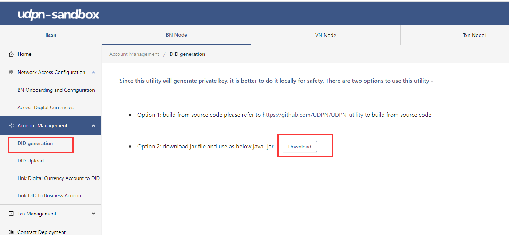
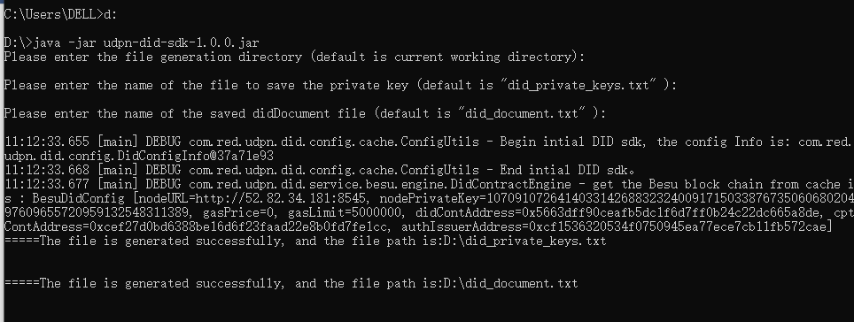
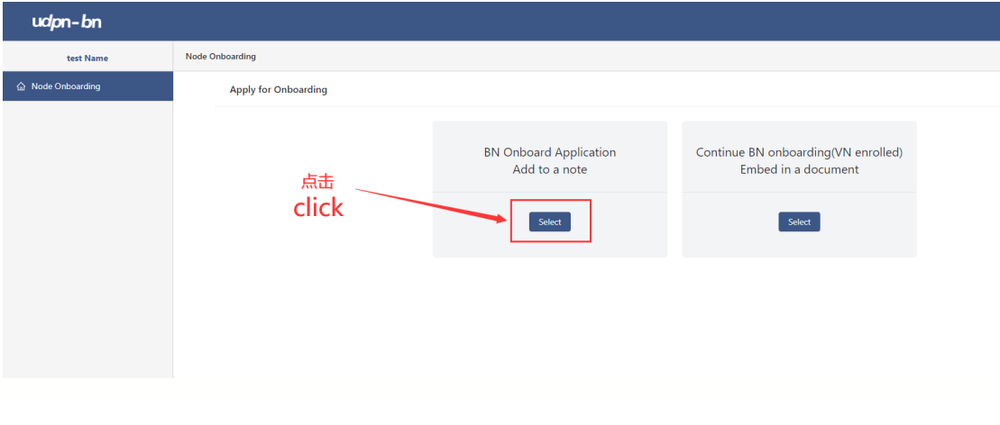
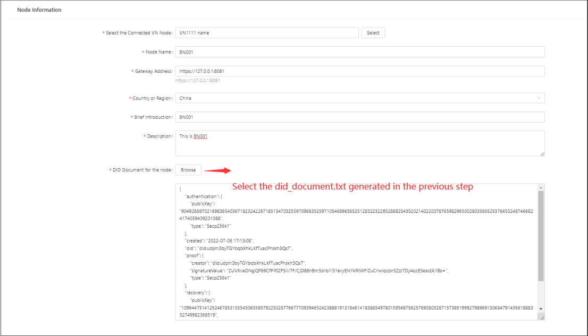
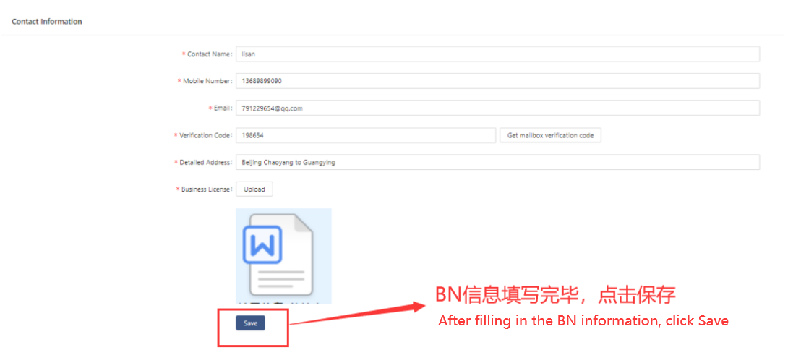

**Business Node Self-Onboarding Manual for the UDPN Sandbox**

1.  Generate a DID Document
    ==========================

    1.  Log in to the sandbox system
        ----------------------------

Open the Sandbox UI (<http://localhost/>) and log in to the Sandbox with the following credentials：

**Username: admin**

Password: abcd1234

Download the UDPN DID Java Archive
-------------------------------

Click on the “Download” to download the “udpn-did-sdk-1.0.0.jar” file, as shown below:

Generate the DID Document
--------------------------

Open the Command Line Interface and cd into the directory where you saved the Java Archive downloaded.
Next, execute the following command: java -jar udpn-did-SDK-1.0.0.jar

Register a Business Node on the UDPN
====================================

1.  

    1.  Log in to the BN system
        -----------------------

Open the BN UI([http://localhost:8080/](http://localhost:8080/))
 and log in to the Sandbox with the following credentials：

**Username: admin**

Password: abcd1234

Apply for Business Node onboarding
----------------------

Choose the first option to the left if this is your first time applying for a Business Node onboarding process.
If you have successfully onboarded your Business Node, please choose the second option to the left.

Fill in and save your BN application
-------------------------------

Complete all required fields as shown on the UI.

Submit your Business Node application for review
-------------------------

After successfully saving your BN onboarding application, click the "Submit" button.

Contact your VN administrator.
========================

After the BN information is submitted successfully, please get in touch with your VN administrator: xxx. The VN administrator will approve your onboarding application to grant you complete access to all Business Node features in the Sandbox.
