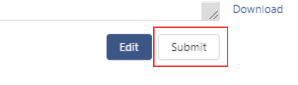

**Business Node Self-Onboarding Manual for the UDPN Sandbox**

Generate a DID Document
==========================

In [README](README.md) step 3, you have already created BN DID document and private key in BN-Sandbox-selfservice-public/docker-compose directory, please use them in the below registration.

Register a Business Node on the UDPN
====================================

Log in to the BN system
-----------------------

Open the BN UI([http://localhost:8080/](http://localhost:8080/))
 and log in to the Sandbox with the following credentials：

**Username: admin**

Password: Abcd1234

Apply for Business Node onboarding
----------------------

Choose the first option to the left if this is your first time applying for a Business Node onboarding process.
If you have successfully onboarded your Business Node, please choose the second option to the left.

Fill in and save your BN application
-------------------------------

Complete all required fields as shown on the UI.

Submit your Business Node application for review
-------------------------

After successfully saving your BN onboarding application, click the "Submit" button.

Contact your VN administrator.
========================

After the BN information is submitted successfully, please get in touch with your VN administrator: xxx. The VN administrator will approve your onboarding application to grant you complete access to all Business Node features in the Sandbox.
