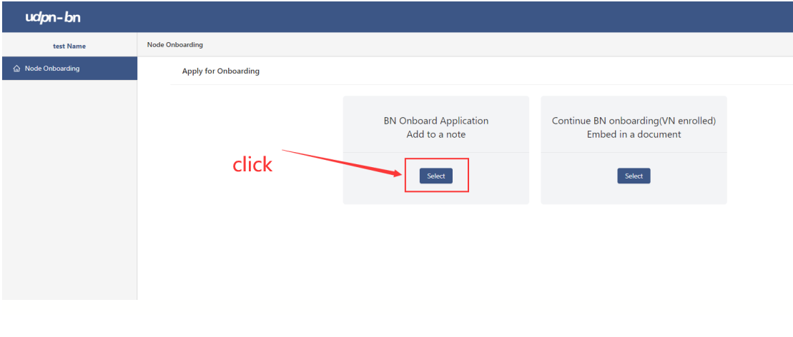
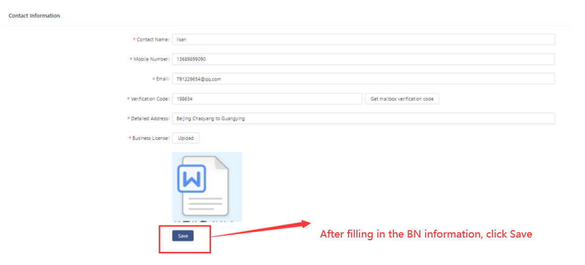

**Sandbox self-onboarding Manual**

**Oct 18, 2022**

**Version V1.0.0**

Index
=====

1. Generate did\_document.txt 3

[1.1 Log in to the sandbox system 3](\l)

[1.2 Download udpn-did-sdk-1.0.0.jar 3](\l)

[1.3 Generate did\_document.txt 3](\l)

[2. BN register to UDPN 4](\l)

[2.1 Log in to the BN system 4](\l)

[2.2 Choose Node onboarding 4](\l)

[2.3 Fill in and save BN information 5](\l)

[2.4 BN information submission 5](\l)

[3. Contact VN administrator 6](\l)

1.  Generate did\_document.txt
    ==========================

    1.  Log in to the sandbox system
        ----------------------------

Open the sandbox system(<http://localhost/>) and log in with ：

**Username: admin**

Password: abcd1234

Download udpn-did-sdk-1.0.0.jar
-------------------------------

Download udpn-did-sdk-1.0.0.jar, as shown below:

Generate did\_document.txt
--------------------------

Open the cmd window, enter the jar directory, and execute the command:
java -jar udpn-did-sdk-1.0.0.jar

BN register to UDPN
===================

1.  

    1.  Log in to the BN system
        -----------------------

Open the BN system([http://localhost:8080/](http://localhost:8080/))
and log in with ：

**Username: admin**

Password: abcd1234

Choose Node onboarding
----------------------

Fill in and save BN information
-------------------------------

BN information submission
-------------------------

After the BN information is saved successfully, click the "Submit"
button

Contact VN administrator
========================

After the BN information is submitted successfully, please contact the
VN administrator: xxx. VN admin will approve your onboarding and after
that you are ready to use BN sandbox totally.
